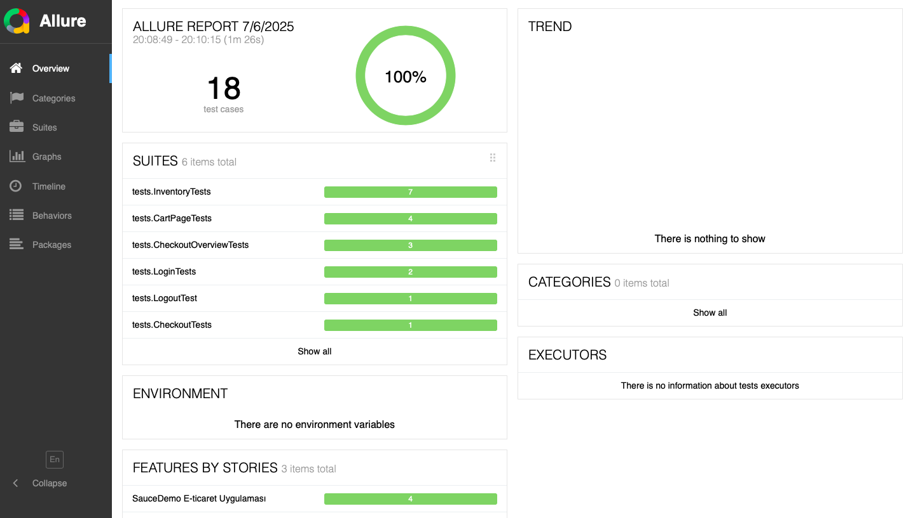

# 🧪 SauceDemo Selenium Java Tests

Bu proje, [SauceDemo](https://www.saucedemo.com/) e-ticaret web uygulamasının test otomasyonunu kapsamaktadır. Proje, Java + Selenium WebDriver kullanılarak, Page Object Model (POM) mimarisiyle yazılmıştır. Ayrıca Allure raporlama entegrasyonu da sağlanmıştır.

---

## 📌 Kullanılan Teknolojiler

- 🟨 Java
- 🧪 JUnit 5
- 🌐 Selenium WebDriver
- 📦 Maven
- 📄 Page Object Model (POM)
- 📊 Allure Report
- 🧠 Git & GitHub
- 💻 IDE: Eclipse

---

## 🗂️ Proje Yapısı
selenium-tests/
│
├── src/
│ ├── main/java/pages/ → Sayfa sınıfları (POM yapısı)
│ └── test/java/tests/ → Test sınıfları
│
├── pom.xml → Maven yapılandırması

## 🚀 Test Senaryoları

- ✅ Başarılı giriş
- ✅ Logout testi
- ✅ Sepete ürün ekleme
- ✅ Sepetten ürün çıkarma
- ✅ Checkout sayfasına geçiş

---

## 📷 Raporlama – Allure Report

Testlerin sonuçları **Allure** ile raporlanır. Aşağıda örnek bir ekran görüntüsü:



Raporu çalıştırmak için:
```bash
mvn clean test
allure serve allure-results
